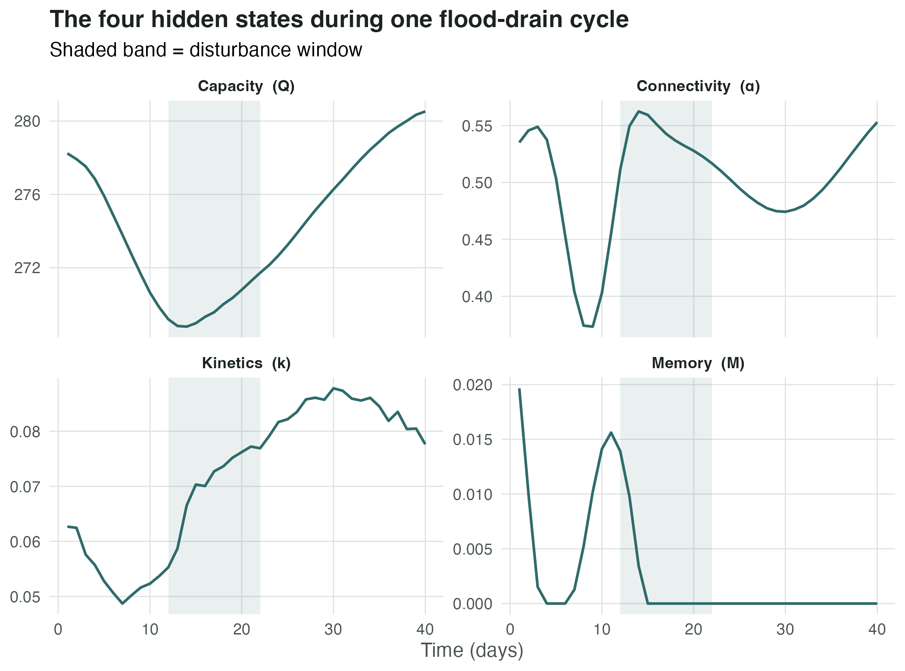
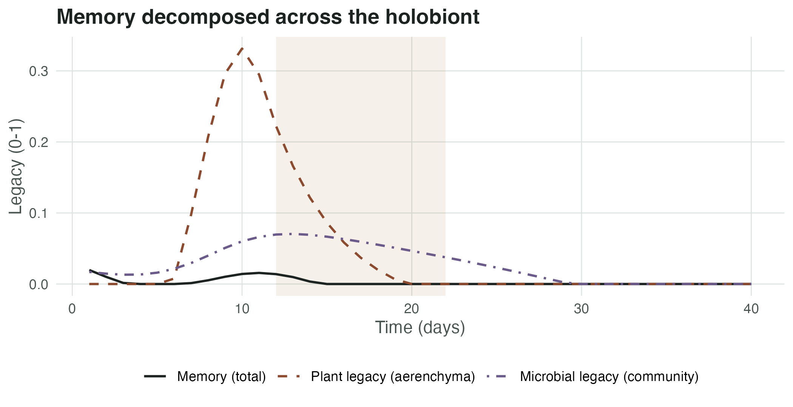
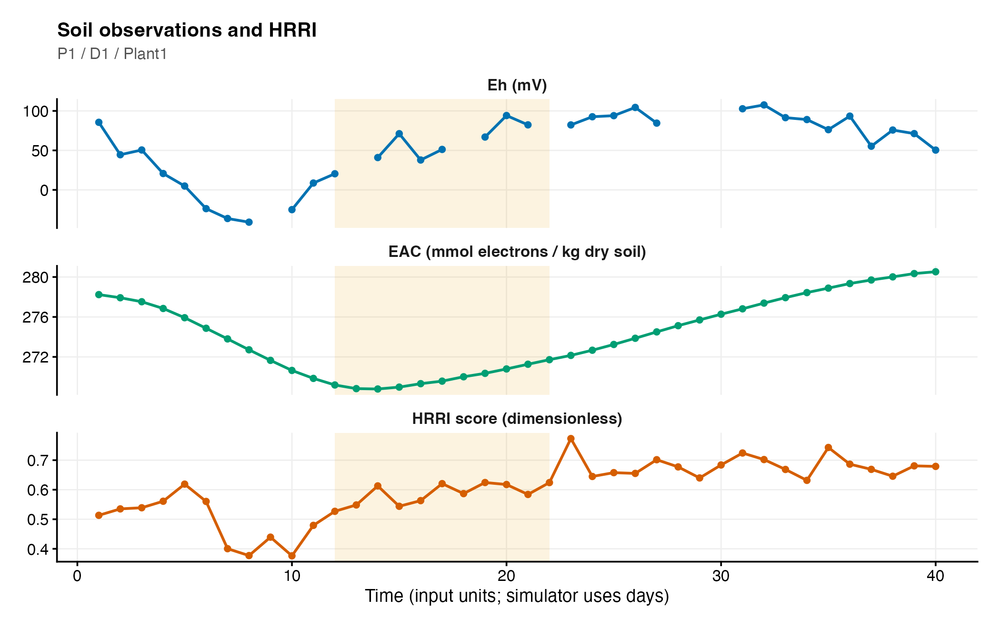
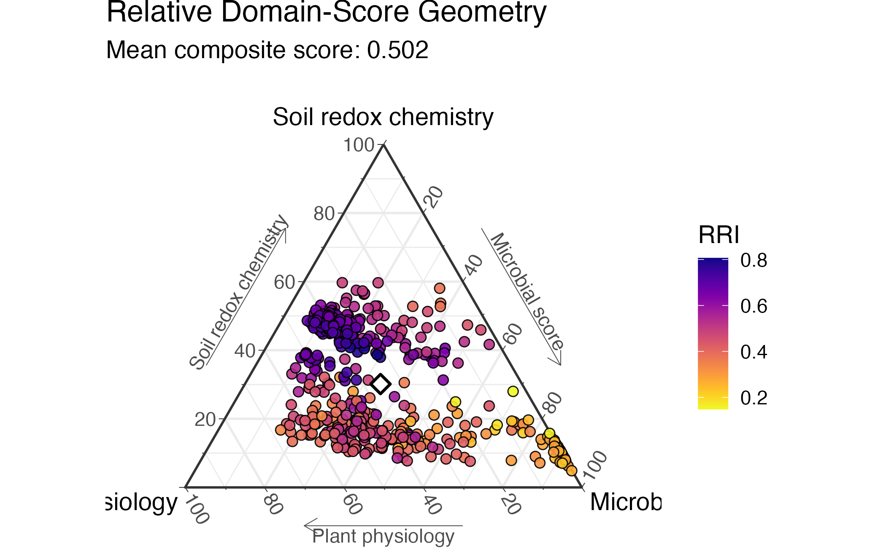
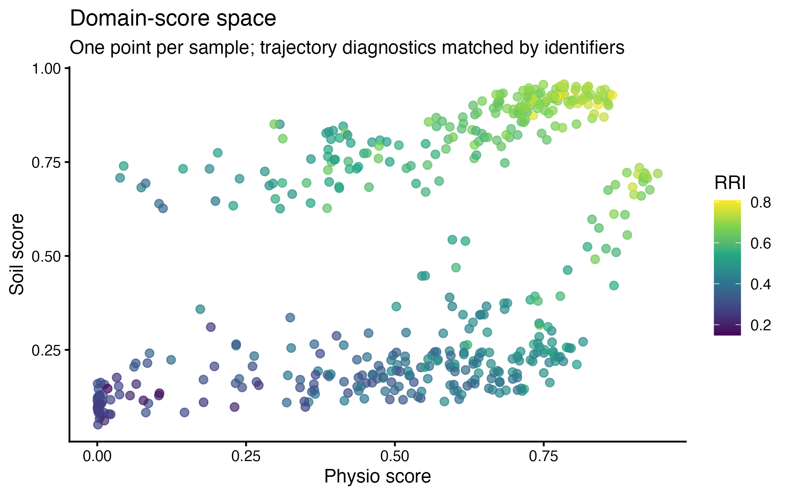
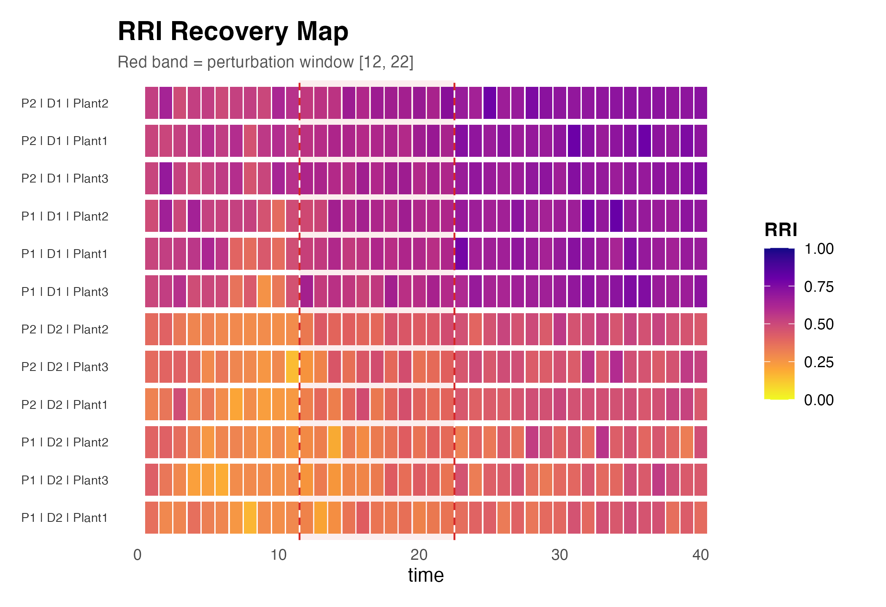
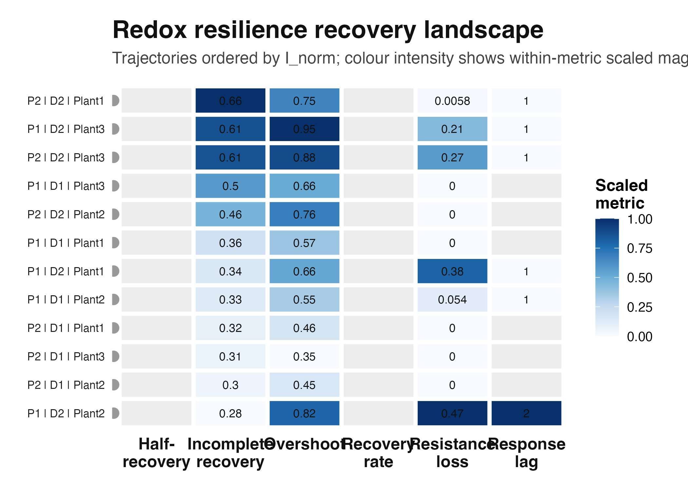
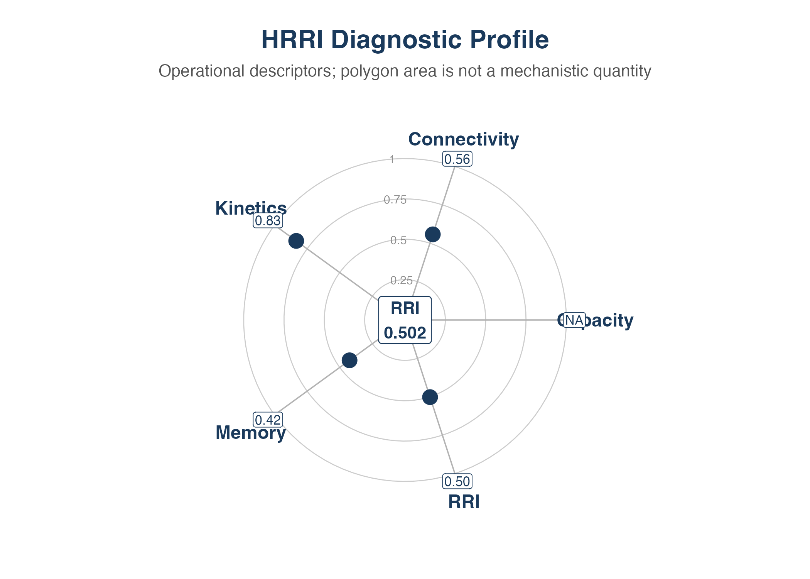
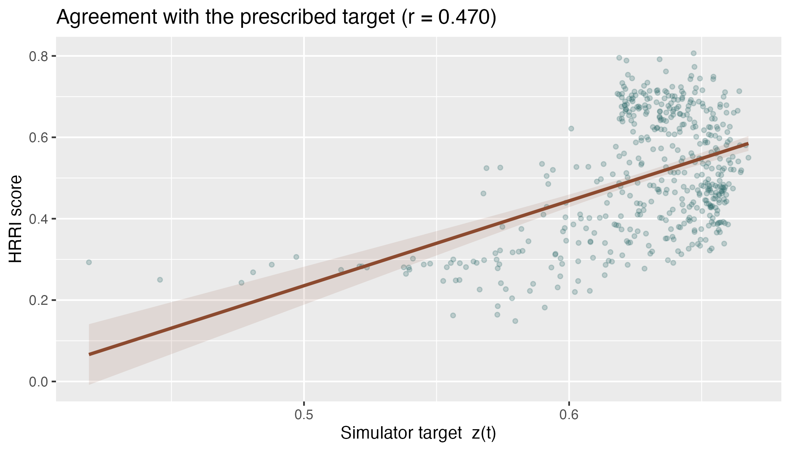

# HRRI: Reading the Figures — A Worked Example

## How to use this vignette

The companion vignette,
[`vignette("HRRI_workflow")`](https://mghotbi.github.io/HRRI/articles/HRRI_workflow.md),
shows *how to run* HRRI. This one shows *how to read what comes out*.

We follow a single simulated experiment from beginning to end. Every
figure is produced from that one experiment, so the panels connect: the
trajectory you see in Section 4 is the same trajectory summarised in
Section 6 and ranked in Section 7.

Each figure is followed by two short blocks:

**Reading it** — what the axes mean and what pattern to look for.

**What it does not show** — the inference the figure cannot support.
HRRI is deliberately conservative, and these limits are part of the
method, not disclaimers bolted on afterwards.

``` r

library(HRRI)
library(ggplot2)
packageVersion("HRRI")
#> [1] '0.99.2'
```

## The experiment

One flood–drain cycle across two plots, two depths and three plants,
observed daily for 40 steps. The disturbance runs from day 12 to day 22.

``` r

PERTURB_START <- 12
PERTURB_END   <- 22

sim <- simulate_redox_holobiont(
  n_plot               = 2,
  n_depth              = 2,
  n_plant              = 3,
  n_time               = 40,
  p_micro              = 25,
  seed                 = 2026,
  scenario             = "flood_drain",
  n_cycles             = 1,
  disturbance_strength = 0.72,
  history_strength     = 0.55
)

nrow(sim$id)          # 2 x 2 x 3 x 40 = 480 observations
#> [1] 480
names(sim$latent_state)
#>  [1] "Q_accept"              "Q_donate"              "alpha_accept"         
#>  [4] "alpha_donate"          "k_accept_h"            "k_donate_h"           
#>  [7] "memory"                "micro_legacy"          "plant_legacy"         
#> [10] "redox_position"        "Cacc_EAC"              "Cacc_EDC"             
#> [13] "net_oxidative_balance"
```

`latent_state` is the simulator’s ground truth. It exists so we can
check whether HRRI recovers what it is meant to recover. With real data
there is no such column, and nothing in the scoring path is allowed to
read it.

## The four hidden states, made visible

HRRI rests on four controls that are never measured directly. In
simulation we can plot them, which is the clearest way to build
intuition for what the index is chasing.

``` r

ls_df <- as.data.frame(sim$latent_state)
one   <- with(sim$id, plot == "P1" & depth == "D1" & plant_id == "Plant1")

hidden <- data.frame(
  time  = sim$id$time[one],
  value = c(
    ls_df$Q_accept[one],
    ls_df$alpha_accept[one],
    ls_df$k_accept_h[one],
    ls_df$memory[one]
  ),
  state = factor(
    rep(c("Capacity  (Q)", "Connectivity  (α)",
          "Kinetics  (k)", "Memory  (M)"), each = sum(one)),
    levels = c("Capacity  (Q)", "Connectivity  (α)",
               "Kinetics  (k)", "Memory  (M)")
  )
)

ggplot(hidden, aes(time, value)) +
  annotate("rect", xmin = PERTURB_START, xmax = PERTURB_END,
           ymin = -Inf, ymax = Inf, fill = "#2f6b6b", alpha = 0.10) +
  geom_line(colour = "#2f6b6b", linewidth = 0.7) +
  facet_wrap(~ state, scales = "free_y", ncol = 2) +
  labs(x = "Time (days)", y = NULL,
       title = "The four hidden states during one flood-drain cycle",
       subtitle = "Shaded band = disturbance window") +
  theme(legend.position = "none")
```



**Reading it** — Capacity is the electron inventory and moves slowly.
Connectivity collapses during flooding as pore pathways close, then
partially reopens. Kinetics tracks the rate of exchange. Memory is the
one that does not come back: it ratchets upward and stays there. That
asymmetry is the whole point of the framework.

### Memory is a holobiont state

Since version 0.99.2, memory accumulates from four sources spanning all
three domains, not from iron chemistry alone. The components are
exported so the decomposition can be checked rather than assumed.

``` r

mem <- data.frame(
  time  = rep(sim$id$time[one], 3),
  value = c(ls_df$memory[one],
            ls_df$plant_legacy[one],
            ls_df$micro_legacy[one]),
  component = factor(
    rep(c("Memory (total)", "Plant legacy (aerenchyma)",
          "Microbial legacy (community)"), each = sum(one)),
    levels = c("Memory (total)", "Plant legacy (aerenchyma)",
               "Microbial legacy (community)")
  )
)

ggplot(mem, aes(time, value, colour = component, linetype = component)) +
  annotate("rect", xmin = PERTURB_START, xmax = PERTURB_END,
           ymin = -Inf, ymax = Inf, fill = "#9a6a24", alpha = 0.10) +
  geom_line(linewidth = 0.7) +
  scale_colour_manual(values = c("#1c2321", "#8c4a2f", "#6b5b8a")) +
  scale_linetype_manual(values = c("solid", "dashed", "dotdash")) +
  labs(x = "Time (days)", y = "Legacy (0-1)", colour = NULL, linetype = NULL,
       title = "Memory decomposed across the holobiont")
```



**Reading it** — the microbial legacy rises quickly under sustained
reduction and relaxes slowly afterwards. That asymmetry is deliberate: a
component that tracked current conditions symmetrically would be a
readout, not a memory.

**What it does not show** — that these are the *correct* weights. They
are illustrative (0.020 event load, 0.016 Fe ratchet, 0.012 plant, 0.012
microbial) and are not calibrated to measured legacy effects in any
field system.

## Scoring the three domains

``` r

res <- rri_pipeline_st(
  ROS_flux     = sim$ROS_flux,
  Eh_stability = sim$Eh_stability,
  micro_data   = sim$micro_data,
  id           = sim$id,
  time_col     = "time",
  group_cols   = c("plot", "depth", "plant_id"),
  mode         = "snapshot",
  reducer      = "per_domain",
  scaling      = "pnorm",
  direction_anchor_phys  = "FvFm",
  direction_anchor_soil  = "Eh",
  direction_anchor_micro = "ASV1"
)

scored <- attach_hrri_ids(res$row_scores, sim$id)
attr(scored, "id_alignment")
#> $method
#> [1] "row_id"
#> 
#> $key
#> [1] "row_id"
#> 
#> $n_rows
#> [1] 480
#> 
#> $n_matched
#> [1] 480
#> 
#> $cols_added
#> character(0)
#> 
#> $cols_shared
#>  [1] "plot"            "depth"           "plant_id"        "time"           
#>  [5] "unit_id"         "history_pair"    "history"         "scenario"       
#>  [9] "rescue"          "cycle"           "phase"           "event_intensity"
#> [13] "WFPS"            "water_table_cm"
summary(scored$RRI)
#>    Min. 1st Qu.  Median    Mean 3rd Qu.    Max. 
#>  0.1485  0.3859  0.4887  0.5024  0.6454  0.8065
```

The `direction_anchor_*` arguments are not optional in practice. Latent
axes from PCA have arbitrary sign; without an anchor variable whose
direction you can justify, a high RRI could mean the opposite of what
you intend. The function warns when anchors are missing.

## One trajectory in context

``` r

plot_rri_timeseries(
  sim, res,
  plot_id       = "P1",
  depth_id      = "D1",
  plant_id      = "Plant1",
  perturb_start = PERTURB_START,
  perturb_end   = PERTURB_END
)
```



**Reading it** — Eh, accessible capacity and the composite RRI on a
shared time axis in separate panels, each in its own units. Look for
whether RRI returns to its pre-event level, and whether it returns at
the same time as Eh. A gap between the two is the interesting case.

**What it does not show** — panels are not placed on a common axis,
because Eh (mV) and RRI (dimensionless) are not commensurable. Visual
co-movement is not evidence of a mechanistic link.

## Where the domains sit relative to each other

``` r

## ggtern is a Suggests dependency and, at the time of writing, is not
## compatible with ggplot2 >= 3.5 (it errors on tern.axis.ticks.length.major).
## Render defensively so the vignette builds either way.
tern_ok <- requireNamespace("ggtern", quietly = TRUE) &&
           requireNamespace("viridis", quietly = TRUE)

if (tern_ok) {
  p_tern <- try(
    plot_RRI_ternary(res$row_scores_comp, point_size = 2.4,
                     show_centroid = TRUE),
    silent = TRUE
  )
  drawn <- !inherits(p_tern, "try-error") &&
           !inherits(try(print(p_tern), silent = TRUE), "try-error")
  if (!drawn) {
    cat("*The ternary plot could not be rendered: the installed **ggtern** is",
        "incompatible with this **ggplot2** version. The composition it would",
        "show is summarised numerically below.*\n\n")
  }
} else {
  cat("*Install **ggtern** and **viridis** to render this figure.*\n\n")
}
```



Whether or not the ternary renders, the same information is available
directly from the compositional table — each row sums to one across the
three domains:

``` r

comp <- res$row_scores_comp[, c("Physio", "Soil", "Micro")]
round(colMeans(comp, na.rm = TRUE), 3)          # centroid
#> Physio   Soil  Micro 
#>  0.357  0.301  0.342
round(range(rowSums(comp, na.rm = TRUE)), 6)    # closure check: both 1
#> [1] 1 1
```

**Reading it** — each point is one observation placed by the *relative*
weight of its Physiology, Soil and Microbial scores. Points near a
vertex are dominated by that domain. The white diamond is the centroid.
Movement of the cloud toward a vertex over an event means the domains
are responding unequally.

**What it does not show** — position is compositional, so it discards
magnitude. Two samples with very different absolute RRI sit at the same
point if their domain *ratios* match. Always read the ternary alongside
Section 4.

## Domain-score state space

``` r

plot_rri_state_space(
  res,
  x_property = "Physio",
  y_property = "Soil",
  colour_by  = "RRI",
  group_cols = c("plot", "depth", "plant_id")
)
```



**Reading it** — the trajectory through domain space. Disturbance
typically pushes points toward the origin; recovery is the return path.
A return that does not retrace its outbound path is hysteresis, and it
is visible here as an open loop.

**What it does not show** — the axes are domain composite scores, not
the hidden states of Section 3. Physiology is not Kinetics; Soil is not
Capacity. Relabelling them as mechanistic properties would be a category
error.

## Recovery signatures

``` r

rec <- rri_recovery_metrics(
  res           = res,
  id            = sim$id,
  time_col      = "time",
  group_cols    = c("plot", "depth", "plant_id"),
  perturb_start = PERTURB_START,
  perturb_end   = PERTURB_END,
  rri_col       = "RRI"
)

rec[1:4, c("plot", "depth", "plant_id", "baseline_rri", "depth_min_frac",
           "tau_lag", "overshoot_frac", "incomplete_return_frac",
           "displaced_plateau_flag", "fit_status")]
#>   plot depth plant_id baseline_rri depth_min_frac tau_lag overshoot_frac
#> 1   P1    D1   Plant1    0.4909106    0.000000000      NA      0.5748788
#> 2   P2    D1   Plant1    0.5445569    0.000000000      NA      0.4606396
#> 3   P1    D2   Plant1    0.2922408    0.378237014       1      0.6628952
#> 4   P2    D2   Plant1    0.2971187    0.005848721       1      0.7475780
#>   incomplete_return_frac displaced_plateau_flag                     fit_status
#> 1              0.3616705                  FALSE          no_resolvable_decline
#> 2              0.3180095                  FALSE          no_resolvable_decline
#> 3              0.3403944                  FALSE insufficient_positive_deficits
#> 4              0.6611020                  FALSE insufficient_positive_deficits
```

**Reading it** — one row per trajectory. `depth_min_frac` is how far the
score fell relative to baseline; `tau_lag` is how long recovery took to
begin; `incomplete_return_frac` is the terminal shortfall. `fit_status`
reports whether the rate estimate is trustworthy — always read `k`
together with it.

**What it does not show** — `alt_routing_flag` is retained as `NA` on
purpose. A displaced plateau is consistent with alternative electron
routing but does not establish it, so the package refuses to claim
otherwise. Use `displaced_plateau_flag` and describe it as a
displacement.

### Recovery map across all trajectories

``` r

plot_rri_recovery_map(
  res           = res,
  id            = sim$id,
  rec           = rec,
  time_col      = "time",
  group_cols    = c("plot", "depth", "plant_id"),
  perturb_start = PERTURB_START,
  perturb_end   = PERTURB_END
)
```



**Reading it** — one row per trajectory, colour = RRI through time. Scan
vertically at any time point to compare units; scan horizontally to
follow one unit. Rows that stay dark to the right of the disturbance
band did not recover.

### Ranking trajectories by signature

``` r

## Name the metrics explicitly rather than relying on the function default.
## Older HRRI builds defaulted to A_norm / O_norm / tau_r, which
## rri_recovery_metrics() no longer produces; being explicit makes this chunk
## work against either version and documents which signatures are shown.
plot_rri_recovery_landscape(
  rec,
  metrics = intersect(
    c("depth_min_frac", "overshoot_frac", "I_norm", "k", "tau_lag", "t_half"),
    names(rec)
  ),
  order_by = "I_norm"
)
```



**Reading it** — trajectories as rows, recovery signatures as columns,
each column scaled within the cohort. It answers “which units behaved
similarly, and on which signature do they differ?” — the ordering is by
incomplete return.

**What it does not show** — scaling is cohort-relative, so a “high” cell
means high *within this run*, not high in absolute terms. Two datasets
cannot be compared cell-by-cell.

## Property diagnostics

``` r

props <- rri_property_scores(res, rec = rec)
props$property_table
#>       property     score                                       method available
#> 1     Capacity        NA                                  unavailable     FALSE
#> 2 Connectivity 0.5576013                       cross_domain_magnitude      TRUE
#> 3     Kinetics 0.8333333               Cohort-relative recovery speed      TRUE
#> 4       Memory 0.4247667 Loop-area/persistent-displacement diagnostic      TRUE

plot_rri_properties(props, rri_value = mean(scored$RRI, na.rm = TRUE))
```



**Reading it** — the four diagnostics on one radar. Unavailable
properties stay missing rather than being imputed, so a short spoke
means “not supported by the supplied data”, not “low”.

**What it does not show** — these are *named after* the four controls
but are not measurements of them. Capacity here is an oxidative-oriented
feature composite; Connectivity is an association descriptor; Kinetics
is a recovery-speed descriptor; Memory is a persistent-displacement
descriptor. Check `props$property_table` to see the method behind each
score.

## Did HRRI recover the hidden state?

Because the simulator defines a target, we can check agreement directly.
This is an internal consistency check, not empirical validation.

``` r

ok <- is.finite(scored$RRI) & is.finite(sim$latent_truth)
r  <- stats::cor(scored$RRI[ok], sim$latent_truth[ok])
cat("r(RRI, latent_truth) =", round(r, 3), "on", sum(ok), "observations\n")
#> r(RRI, latent_truth) = 0.47 on 480 observations

ggplot(data.frame(truth = sim$latent_truth[ok], RRI = scored$RRI[ok]),
       aes(truth, RRI)) +
  geom_point(alpha = 0.25, size = 1.1, colour = "#2f6b6b") +
  geom_smooth(method = "lm", formula = y ~ x, se = TRUE,
              colour = "#8c4a2f", fill = "#8c4a2f", alpha = 0.12) +
  labs(x = "Simulator target  z(t)", y = "HRRI score",
       title = sprintf("Agreement with the prescribed target (r = %.3f)", r))
```



**What it does not show** — this is agreement with a target *we
defined*. It demonstrates that the scoring path is internally coherent.
It is not predictive accuracy, not held-out error, and not evidence that
HRRI tracks resilience in any real soil.

## Using your own data

Every function above accepts plain data frames. Replace the simulator
with your own measurements, keeping rows aligned across blocks:

``` r

res <- rri_pipeline(
  soil  = my_soil,      # Eh, pH, Fe pools, EAC/EDC ...
  plant = my_plant,     # SPAD, Fv/Fm, ROL ...
  micro = my_micro,     # ASV table or functional genes
  id    = my_ids,       # plot, depth, plant_id, time
  direction_anchor_soil = "Eh",
  direction_anchor_phys = "FvFm"
)
```

Missing a domain is fine — supply what you have. Absent domains stay
`NA`, remaining weights renormalise per row, and coverage is reported so
a reduced panel is never silently treated as a complete one.

A reduced panel changes the estimand. Scores from a soil-only run and a
three-domain run are not interchangeable; compare them through
[`rri_sensitivity()`](https://mghotbi.github.io/HRRI/reference/rri_sensitivity.md)
rather than assuming equivalence.

## Session information

``` r

sessionInfo()
#> R version 4.5.1 (2025-06-13)
#> Platform: aarch64-apple-darwin20
#> Running under: macOS Tahoe 26.5.1
#> 
#> Matrix products: default
#> BLAS:   /Library/Frameworks/R.framework/Versions/4.5-arm64/Resources/lib/libRblas.0.dylib 
#> LAPACK: /Library/Frameworks/R.framework/Versions/4.5-arm64/Resources/lib/libRlapack.dylib;  LAPACK version 3.12.1
#> 
#> locale:
#> [1] en_US.UTF-8/en_US.UTF-8/en_US.UTF-8/C/en_US.UTF-8/en_US.UTF-8
#> 
#> time zone: Europe/Berlin
#> tzcode source: internal
#> 
#> attached base packages:
#> [1] stats     graphics  grDevices utils     datasets  methods   base     
#> 
#> other attached packages:
#> [1] ggplot2_4.0.3 HRRI_0.99.2  
#> 
#> loaded via a namespace (and not attached):
#>  [1] viridis_0.6.5      tensorA_0.36.2.1   sass_0.4.10        generics_0.1.4    
#>  [5] tidyr_1.3.2        robustbase_0.99-7  lattice_0.23-1     digest_0.6.39     
#>  [9] magrittr_2.0.5     bayesm_3.1-7       evaluate_1.0.5     grid_4.5.1        
#> [13] RColorBrewer_1.1-3 fastmap_1.2.0      Matrix_1.7-6       plyr_1.8.9        
#> [17] jsonlite_2.0.0     gridExtra_2.3.1    mgcv_1.9-4         purrr_1.2.2       
#> [21] viridisLite_0.4.3  scales_1.4.0       textshaping_1.0.5  jquerylib_0.1.4   
#> [25] cli_3.6.6          rlang_1.3.0        splines_4.5.1      withr_3.0.3       
#> [29] cachem_1.1.0       yaml_2.3.12        otel_0.2.0         proto_1.0.0       
#> [33] tools_4.5.1        dplyr_1.2.1        latex2exp_0.9.8    compositions_2.0-9
#> [37] ggtern_4.0.0       vctrs_0.7.3        R6_2.6.1           lifecycle_1.0.5   
#> [41] fs_2.1.0           htmlwidgets_1.6.4  MASS_7.3-66        ragg_1.5.2        
#> [45] pkgconfig_2.0.3    desc_1.4.3         pkgdown_2.2.1      pillar_1.11.1     
#> [49] bslib_0.12.0       hexbin_1.28.6      gtable_0.3.6       glue_1.8.1        
#> [53] Rcpp_1.1.2         systemfonts_1.3.2  DEoptimR_1.2-1     xfun_0.60         
#> [57] tibble_3.3.1       tidyselect_1.2.1   rstudioapi_0.18.0  knitr_1.51        
#> [61] farver_2.1.2       nlme_3.1-170       htmltools_0.5.9    igraph_2.3.3      
#> [65] rmarkdown_2.31     labeling_0.4.3     compiler_4.5.1     S7_0.2.2
```
