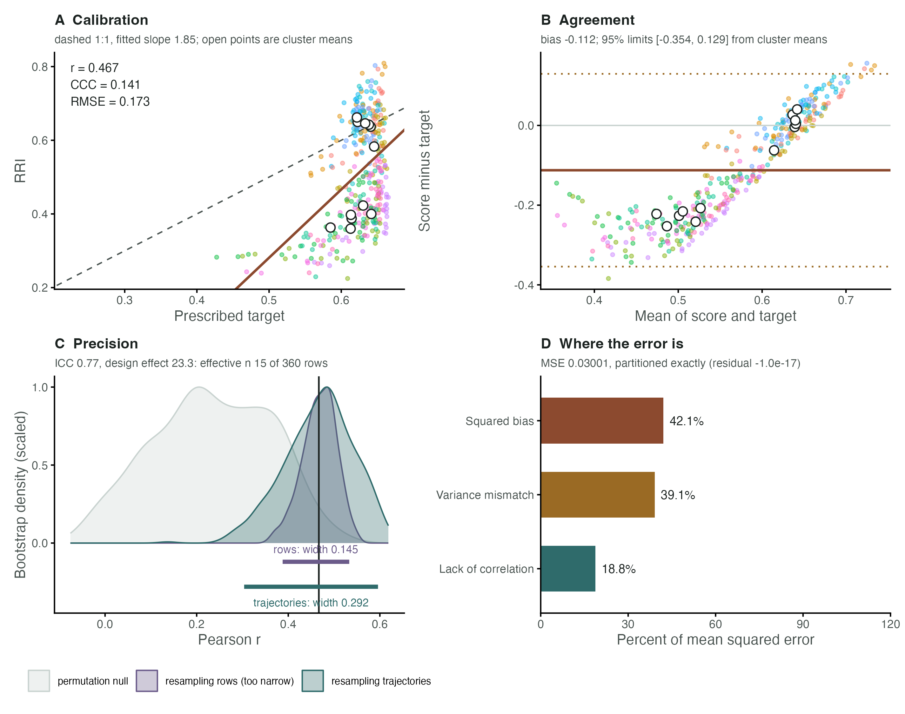

# HRRI: Holobiont Redox Resilience Index — End-to-End Workflow

## Introduction

The **HRRI** package implements exploratory, multi-domain diagnostics
for describing how soil–plant–microbiome systems buffer and recover from
hydroclimatic redox disturbances (Ghotbi *et al.*, 2026). The
theoretical framing distinguishes four properties. They are not all
identifiable from a single observation curve:

| Property | Symbol | Interpretation |
|----|----|----|
| Capacity | $`Q`$ | Electron-accepting and electron-donating inventory available within the system (mmol e⁻ kg⁻¹) |
| Connectivity | $`\alpha`$ | Fraction of $`Q`$ electrochemically accessible to porewater |
| Kinetics | $`k`$ | Characteristic rate of electron exchange under physicochemical and biological constraints (h⁻¹) |
| Memory | $`M`$ | Legacy of prior disturbances retained through persistent biogeochemical, microbial and physiological states that influence future system responses |

These combine through the accessible-capacity formula:

\$\$C\_{\rm acc} = \sum_i Q_i \cdot \alpha_i \cdot \left(1 - e^{-k_i
\tau}\right)\$\$

and aggregate into the Holobiont Redox Resilience Index:

``` math
\mathrm{RRI}_{it} = w_P \cdot P_{it} + w_S \cdot S_{it} + w_M \cdot M_{it}
```

where $`P`$ (Physiology), $`S`$ (Soil), and $`M`$ (Microbial) are domain
scores.

This vignette walks through the full workflow from in-silico data
generation to RRI computation, accessible-capacity estimation, and
recovery-signature metrics — all driven by
[`simulate_redox_holobiont()`](https://mghotbi.github.io/HRRI/reference/simulate_redox_holobiont.md).

## In-silico Data Generation

[`simulate_redox_holobiont()`](https://mghotbi.github.io/HRRI/reference/simulate_redox_holobiont.md)
is the package’s master simulator. It generates synthetic longitudinal
observations across all three holobiont domains.

Only Fe and Mn inventories carry closed-balance checks. Carbon,
nitrogen, sulfur and oxygen budgets are **not** closed, and all rate
parameters are illustrative rather than field-calibrated. Simulated
output supports software demonstration and falsifiable model checks, not
empirical ecological inference.

``` r

library(HRRI)
packageVersion("HRRI")
#> [1] '1.0.5'

## Compatibility shim -----------------------------------------------------
## rri_pipeline() is the convenience wrapper around rri_pipeline_st().
## If the *installed* HRRI predates the wrapper, define an equivalent local
## version so this vignette knits against either release. Reinstall the
## package (see README) to use the exported function directly.
if (!exists("rri_pipeline", mode = "function")) {
  message("Installed HRRI has no rri_pipeline(); using a vignette-local wrapper.")
  rri_pipeline <- function(dat = NULL, soil = NULL, plant = NULL,
                           micro = NULL, id = NULL,
                           domain_weights = c(Physio = 0.4, Soil = 0.35,
                                              Micro = 0.25), ...) {
    stopifnot(setequal(names(domain_weights),
                       c("Physio", "Soil", "Micro")))
    w <- domain_weights[c("Physio", "Soil", "Micro")]
    w <- w / sum(w)
    res <- rri_pipeline_st(
      ROS_flux = plant, Eh_stability = soil, micro_data = micro, id = id,
      w1 = unname(w[1]), w2 = unname(w[2]), w3 = unname(w[3]), ...
    )
    res$scores <- res$row_scores
    res
  }
}

## Reproducible 1-cycle flood-drain experiment
## n_plot=2, n_depth=2, n_plant=3, n_time=30 -> 360 rows
sim <- simulate_redox_holobiont(
  n_plot               = 2,
  n_depth              = 2,
  n_plant              = 3,
  n_time               = 30,
  p_micro              = 20,
  seed                 = 42,
  scenario             = "flood_drain",
  n_cycles             = 1,
  disturbance_strength = 0.70,
  history_strength     = 0.55,
  decoupling           = 0.20
)

## Top-level structure
names(sim)
#>  [1] "id"                   "forcing"              "latent_state"        
#>  [4] "soil_data"            "plant_data"           "micro_gene_abundance"
#>  [7] "micro_metat_counts"   "micro_metat_metadata" "micro_traits"        
#> [10] "fluxes"               "conservation_checks"  "ROS_flux"            
#> [13] "Eh_stability"         "micro_data"           "latent_truth"        
#> [16] "graph"                "metadata"
nrow(sim$id)                   # one row per plot × depth × plant × time
#> [1] 360
```

### Design identifiers

``` r

head(sim$id[, c("plot","depth","plant_id","time","cycle","phase","WFPS")])
#>   plot depth plant_id time cycle    phase      WFPS
#> 1   P1    D1   Plant1    1     1 baseline 0.6489965
#> 2   P2    D1   Plant1    1     1 baseline 0.5812486
#> 3   P1    D2   Plant1    1     1 baseline 0.7989965
#> 4   P2    D2   Plant1    1     1 baseline 0.7312486
#> 5   P1    D1   Plant2    1     1 baseline 0.6489965
#> 6   P2    D1   Plant2    1     1 baseline 0.5812486
```

### Soil geochemical outputs

``` r

head(sim$soil_data[, c("EAC","EDC","Cacc_EAC","Cacc_total","Cacc_fraction",
                        "FeIII_poor_crystalline_mmol_kg",
                        "FeII_mmol_kg","Eh","pH")])
#>        EAC      EDC Cacc_EAC Cacc_total Cacc_fraction
#> 1 266.3053 112.0382 110.4102   147.6319     0.3902060
#> 2 298.1276 119.3425 125.0644   162.0105     0.3880769
#> 3 337.3575 141.5196 107.5981   155.6755     0.3250845
#> 4 356.4329 146.4849 135.8578   188.5886     0.3749889
#> 5 279.5978 104.1723 113.5038   146.9287     0.3828560
#> 6 286.3268 115.3987 116.9400   152.2080     0.3788855
#>   FeIII_poor_crystalline_mmol_kg FeII_mmol_kg       Eh       pH
#> 1                       67.13652     17.26132 46.28567 6.657346
#> 2                       70.93895     17.91741 79.80817 6.544344
#> 3                       93.28308     24.82342       NA 6.653453
#> 4                       99.62313     26.34155 19.81601 6.475302
#> 5                       67.21437     17.18353 56.59732 6.725813
#> 6                       70.95279     17.89324 93.27404 6.800352
```

### Fe mass-balance verification

``` r

## Maximum absolute error should be < 0.01 mmol kg-1
sim$conservation_checks
#>                                    check        value
#> 1 maximum_absolute_Fe_mass_balance_error 1.136868e-13
#> 2 maximum_absolute_Mn_mass_balance_error 1.421085e-14
#> 3                 minimum_simulated_pool 0.000000e+00
#> 4                 nonnegative_pool_check 1.000000e+00
```

### Plant physiology

``` r

head(sim$plant_data[, c("SPAD","FvFm","ROL","ROS_load","aerenchyma")])
#>       SPAD      FvFm       ROL  ROS_load aerenchyma
#> 1 41.64819 0.8149359 0.3165926 0.1962876  0.1169200
#> 2 41.74657 0.8053272 0.3388381 0.1817415  0.1169200
#> 3 43.48661 0.7906804 0.3122744 0.2424358  0.1313152
#> 4 43.51764 0.8002821 0.3490689 0.1989893  0.1169200
#> 5 43.78669 0.8166172 0.3719281 0.1993879  0.2164600
#> 6 42.65099 0.7954301 0.4006285 0.1613636  0.2164600
```

### Microbial functional genes

``` r

## 18 genes spanning Fe-cycling, denitrification, nitrification,
## methanogenesis, and sulfur cycling
colnames(sim$micro_gene_abundance)
#>  [1] "mtrA"     "omcS"     "cyc2"     "mnxG"     "narG"     "napA"    
#>  [7] "nirK"     "nirS"     "norB"     "nosZ"     "nrfA"     "amoA_AOA"
#> [13] "amoA_AOB" "nxrB"     "dsrA"     "dsrB"     "mcrA"     "pmoA"
summary(sim$micro_gene_abundance[, "mcrA"])   # methanogenesis gene
#>    Min. 1st Qu.  Median    Mean 3rd Qu.    Max. 
#>   56717  142005  186655  196218  235030  582998
```

## Accessible-Capacity Estimation

[`rri_accessible_capacity()`](https://mghotbi.github.io/HRRI/reference/rri_accessible_capacity.md)
computes \$C\_{\rm acc}\$ for arbitrary mineralogical reservoirs with
explicitly supplied accessibility and exchange-rate parameters. The
values below are illustrative model inputs, not estimates or validated
literature defaults.

``` r

## Subset one plot-depth unit for illustration
idx <- sim$id$plot == "P1" & sim$id$depth == "D1" & sim$id$plant_id == "Plant1"
sdf <- sim$soil_data[idx, ]

## Define reservoir specifications
## (Q_col names must match columns in sdf)
res_spec <- list(
  reactive_FeIII = list(
    Q_col = "FeIII_poor_crystalline_mmol_kg",
    alpha = "alpha_accept",   # column name: per-row connectivity
    k     = "k_accept_h",     # column name: per-row kinetics
    type  = "EAC"
  ),
  crystalline_FeIII = list(
    Q_col = "FeIII_crystalline_mmol_kg",
    alpha = 0.20,             # attenuated connectivity for crystalline phases
    k     = 0.008,            # h-1: slow exchange (goethite/hematite)
    type  = "EAC"
  ),
  FeII_pool = list(
    Q_col = "FeII_mmol_kg",
    alpha = "alpha_donate",
    k     = "k_donate_h",
    type  = "EDC"
  )
)

## tau = 24 h (diurnal event timescale)
cap <- rri_accessible_capacity(sdf, res_spec, tau = 24,
                                normalise = FALSE, return_components = TRUE)

## Per-component summary (returned because return_components = TRUE)
cap$components
#>           reservoir type  alpha k_per_tau_unit saturation_fraction mean_Q
#> 1    reactive_FeIII  EAC 0.5062         0.0672              0.7931 62.820
#> 2 crystalline_FeIII  EAC 0.2000         0.0080              0.1747 54.059
#> 3         FeII_pool  EDC 0.4807         0.0453              0.6602 20.947
#>   mean_contribution
#> 1            25.339
#> 2             1.889
#> 3             6.623

## Mean accessible vs. total inventory
cat("Mean Cacc_raw:", mean(cap$cacc_raw, na.rm=TRUE), "mmol e- kg-1\n")
#> Mean Cacc_raw: 33.85137 mmol e- kg-1
cat("Mean fraction :", mean(cap$cacc_fraction, na.rm=TRUE), "\n")
#> Mean fraction : 0.2456018
if ("ck_limited" %in% names(cap) && length(cap$ck_limited)) {
  cat("CK-limited rows:", sum(cap$ck_limited, na.rm=TRUE),
      "/", sum(!is.na(cap$ck_limited)), "classified rows\n")
} else {
  cat("CK-limited classification is not returned by this HRRI version.\n")
}
#> CK-limited rows: 0 / 0 classified rows
```

### Effect of event timescale τ

``` r

tau_vals <- c(1, 6, 24, 72, 168, 720)   # 1 h to 30 d
cacc_tau <- sapply(tau_vals, function(tt) {
  r <- rri_accessible_capacity(sdf, res_spec, tau = tt, normalise = FALSE)
  mean(r$cacc_raw, na.rm = TRUE)
})
data.frame(tau_h = tau_vals, Cacc_mean = round(cacc_tau, 2))
#>   tau_h Cacc_mean
#> 1     1      2.61
#> 2     6     13.47
#> 3    24     33.85
#> 4    72     45.84
#> 5   168     49.84
#> 6   720     52.63
```

## RRI Pipeline

[`rri_pipeline()`](https://mghotbi.github.io/HRRI/reference/rri_pipeline.md)
integrates available observed domains into an exploratory composite. The
simulator’s hidden architecture columns are excluded. We use explicit
measured anchors to orient otherwise arbitrary PCA axes.

``` r

rri_out <- rri_pipeline(
  plant        = sim$ROS_flux,
  soil         = sim$Eh_stability,
  micro        = log1p(sim$micro_gene_abundance),
  id           = sim$id,
  mode         = "snapshot",
  scaling      = "pnorm",
  direction_anchor_phys = "FvFm",
  direction_anchor_soil = "Eh",
  direction_anchor_micro = "mtrA",
  domain_weights = c(Physio=0.35, Soil=0.40, Micro=0.25)
)

## Align once and reuse this identifier-complete table downstream.
rri_scored <- attach_hrri_ids(rri_out$row_scores, sim$id)
attr(rri_scored, "id_alignment")
#> [1] "observation keys"
summary(rri_scored$RRI)
#>    Min. 1st Qu.  Median    Mean 3rd Qu.    Max. 
#>  0.2247  0.3866  0.5125  0.5126  0.6417  0.8091
head(rri_scored[, c("plot", "depth", "plant_id", "time",
                    "RRI", "Physio", "Soil", "Micro")])
#>   plot depth plant_id time       RRI    Physio      Soil     Micro
#> 1   P1    D1   Plant1    1 0.5331287 0.4047907 0.8681722 0.1767324
#> 2   P2    D1   Plant1    1 0.6660409 0.4460895 0.7806314 0.7906280
#> 3   P1    D2   Plant1    1 0.4499651 0.4141672 0.2643849 0.7970104
#> 4   P2    D2   Plant1    1 0.4119487 0.5263208 0.1609431 0.6534366
#> 5   P1    D1   Plant2    1 0.6296590 0.4048218 0.8278830 0.6272726
#> 6   P2    D1   Plant2    1 0.5933279 0.4741678 0.8424479 0.3615599
```

Alignment uses complete observation keys, or a shared unique `row_id`
when available. If neither is returned the pipeline must preserve input
row order — matching row counts alone do **not** establish alignment.
Shared identifier columns are checked for conflicts rather than silently
overwritten.

### Agreement with the prescribed target

A single pooled correlation is the wrong summary here, for two reasons.

First, these 360 rows are **12 trajectories observed at 30 time
points**, not 360 independent observations. Rows within a trajectory are
strongly dependent, so an interval computed from the row count is far
too narrow.

Second, Pearson’s $`r`$ measures *association*, not *agreement*. A score
equal to twice the target plus a constant correlates with it perfectly
while matching it nowhere. Lin’s concordance correlation coefficient
penalises departure from the 1:1 line and is the quantity that belongs
beside it.

[`rri_accuracy()`](https://mghotbi.github.io/HRRI/reference/rri_accuracy.md)
reports both, with intervals obtained by resampling whole trajectories
rather than rows.

``` r

## rri_scored is aligned to sim$id, and hence to its latent_truth vector.
truth <- sim$latent_truth
if (!is.numeric(truth) || length(truth) != nrow(rri_scored)) {
  stop("latent_truth must be a numeric vector with one value per sim$id row.")
}

## One independent experimental unit = one plot x depth x plant trajectory.
traj <- interaction(rri_scored$plot, rri_scored$depth, rri_scored$plant_id,
                    drop = TRUE)

acc <- rri_accuracy(
  score   = rri_scored$RRI,
  target  = truth,
  cluster = traj,
  n_boot  = 500,
  n_perm  = 500,
  seed    = 42
)

acc
#> Agreement with reference target
#> -------------------------------------------------------------- 
#>  statistic row_level cluster_mean_level ci_lower ci_upper
#>  pearson_r    0.4668             0.5454   0.3037   0.5959
#>   lins_ccc    0.1412             0.0782   0.0829   0.2147
#>       rmse    0.1732             0.1631   0.1296   0.2052
#>        mae    0.1415             0.1264   0.0971   0.1836
#>       bias   -0.1124            -0.1124  -0.1688  -0.0497
#>         r2  -21.5196           -98.0483 -34.2773 -14.7249
#> 
#> Dependence structure
#>   360 observations in 12 clusters (mean size 30.0)
#>   ICC 0.768, design effect 23.3, effective n 15
#> 
#> Error decomposition (percent of MSE)
#>   squared_bias          42.1%
#>   variance_mismatch     39.1%
#>   lack_of_correlation   18.8%
#> 
#> Calibration: target = 0.565 + 0.118 x score  (ideal 0 and 1)
#> Cluster permutation test: p = 0.0220 (500 permutations)
#> 
#> Notes
#>   Rows are strongly clustered (ICC 0.77, design effect 23.3). The 360
#>   observations carry roughly the information of 15 independent ones; quote
#>   the cluster bootstrap interval, not one based on n = 360. 
#>   Ignoring clustering would give a 95% interval for r of width 0.145;
#>   resampling whole trajectories gives width 0.292, 2.0 times wider. Report
#>   the latter. 
#>   Correlation (0.467) exceeds concordance (0.141). The score tracks the
#>   target's pattern but does not agree with it in level or scale; see
#>   calibration. 
#>   Calibration slope is 0.12 rather than 1: the score compresses or
#>   exaggerates the target's range. 
#>   R2 is negative: as an absolute predictor the score does worse than the
#>   target's own mean. It may still rank correctly; check pearson_r. 
#>   Error is dominated by squared_bias (42% of MSE). 
#>   If score and target derive from the same generator, this is internal
#>   consistency, not validation.
```

`effective_n` in the dependence table, not the row count, is what
governs precision. Where the design effect is well above one, the naive
interval should not be quoted: the function prints both widths so the
difference is visible rather than asserted.

Splitting the error says which kind of disagreement is present, and the
three components sum to the mean squared error exactly.

``` r

acc$decomposition[, c("component", "percent")]
#>             component  percent
#> 1        squared_bias 42.10174
#> 2   variance_mismatch 39.10814
#> 3 lack_of_correlation 18.79012

## Exactness check: the residual is numerical noise, not a rounding allowance.
c(mse      = attr(acc$decomposition, "mse"),
  residual = attr(acc$decomposition, "residual"))
#>           mse      residual 
#>  3.000571e-02 -1.040834e-17
```

Large squared bias is a systematic offset, removable by recentring.
Large variance mismatch means the score is flatter or more volatile than
the target. Large lack of correlation means the score does not track the
target’s pattern, and no rescaling will repair it.

[`plot_rri_accuracy()`](https://mghotbi.github.io/HRRI/reference/plot_rri_accuracy.md)
draws the same four questions as one figure.

``` r

plot_rri_accuracy(acc,
                  score_label  = "RRI",
                  target_label = "Prescribed target")
```



**Reading it.** **A** puts the fitted line against the dashed 1:1 line;
a flatter fit means the score compresses the target’s range. Open points
are trajectory means, the level at which the units are independent.
**B** is a Bland-Altman plot: a scatter that slopes or fans out shows
disagreement that depends on level, which no correlation coefficient can
reveal. **C** is the headline: the violet distribution resamples rows
and is too narrow, the teal one resamples trajectories and is honest;
the bars beneath give both widths. **D** partitions the mean squared
error exactly.

**What it does not show.** None of the four panels speaks to
out-of-sample performance. The target is prescribed by the same
simulator that produced the inputs, so a tight panel A means the
estimator is self-consistent, not that it would recover an unobserved
field quantity.

`latent_truth` and `RRI` are produced by the same generator. Everything
above therefore quantifies **internal consistency** — whether the
estimator recovers the target its own simulator prescribed. It is not
independent predictive validation, and it is not evidence that the
individual latent parameters have been identified. An empirical claim
requires a target measured independently of the score, replicated across
independent experimental units.

## Recovery Signatures

[`rri_recovery_metrics()`](https://mghotbi.github.io/HRRI/reference/rri_recovery_metrics.md)
summarizes the RRI trajectory around a specified disturbance window. The
output fields depend on the installed package version; the complete
returned table is displayed below without assuming legacy names. A score
minimum or persistent departure alone does not establish biochemical
pathway truncation or alternative routing. Those interpretations require
independent process evidence.

The function requires **one row per time point per group**. Because the
pipeline returns one row per plant, we must first average RRI across
plants within each plot × depth × time cell before calling recovery
metrics.

``` r

## Step 1 — use the aligned score table created in the pipeline chunk.
## Step 2 — aggregate to one row per plot × depth × time (mean over plants).
## The data-frame method avoids formula-level complete-case filtering.
## An all-missing group remains NA; it is not replaced by zero.
rri_agg <- stats::aggregate(
  x = rri_scored["RRI"],
  by = rri_scored[c("plot", "depth", "time")],
  FUN = finite_mean
)
rri_agg <- rri_agg[order(rri_agg$plot, rri_agg$depth, rri_agg$time), ,
                   drop = FALSE]
rownames(rri_agg) <- NULL
stopifnot(!anyDuplicated(rri_agg[c("plot", "depth", "time")]))

## Step 3 — extract recovery signatures.
## Pass rri_agg directly (group columns are already inside it; no id= needed).
metrics <- rri_recovery_metrics(
  res           = rri_agg,
  time_col      = "time",
  group_cols    = c("plot","depth"),
  perturb_start = 8,
  perturb_end   = 18,
  rri_col       = "RRI",
  forcing_col   = NULL   # no measured forcing supplied
)

if (!is.data.frame(metrics) || nrow(metrics) == 0L) {
  stop("rri_recovery_metrics() returned no nonempty recovery data frame.")
}
names(metrics)
#>  [1] "plot"                    "depth"                  
#>  [3] "baseline_rri"            "min_rri"                
#>  [5] "depth_min"               "depth_min_frac"         
#>  [7] "tau_lag"                 "k_recovery"             
#>  [9] "t_half"                  "overshoot"              
#> [11] "overshoot_frac"          "H_hysteresis"           
#> [13] "H_axis"                  "temporal_asymmetry"     
#> [15] "incomplete_return"       "incomplete_return_frac" 
#> [17] "displaced_plateau_flag"  "displaced_plateau_level"
#> [19] "alt_routing_flag"        "alt_routing_level"      
#> [21] "n_pre"                   "n_perturb"              
#> [23] "n_recovery"              "n_missing"              
#> [25] "n_fit"                   "fit_status"             
#> [27] "fit_r_squared"           "fit_start_time"         
#> [29] "final_observation_time"  "hysteresis_status"      
#> [31] "k"                       "H"                      
#> [33] "I"                       "H_abs"                  
#> [35] "H_norm"                  "I_norm"
metrics
#>   plot depth baseline_rri   min_rri  depth_min depth_min_frac tau_lag
#> 1   P1    D1    0.5591538 0.5034299 0.05572390     0.09965755       2
#> 2   P1    D2    0.3294619 0.2887310 0.04073096     0.12362875       2
#> 3   P2    D1    0.5909879 0.6074584 0.00000000     0.00000000      NA
#> 4   P2    D2    0.3432471 0.2759822 0.06726483     0.19596623       2
#>   k_recovery t_half overshoot overshoot_frac H_hysteresis      H_axis
#> 1         NA     NA 0.1737384      0.3107167           NA unavailable
#> 2         NA     NA 0.1384419      0.4202061           NA unavailable
#> 3         NA     NA 0.1582404      0.2677557           NA unavailable
#> 4         NA     NA 0.1773574      0.5167048           NA unavailable
#>   temporal_asymmetry incomplete_return incomplete_return_frac
#> 1                  1        0.15695467              0.2807003
#> 2                  1        0.09541137              0.2895976
#> 3                 NA        0.14459650              0.2446691
#> 4                  1        0.12096242              0.3524063
#>   displaced_plateau_flag displaced_plateau_level alt_routing_flag
#> 1                   TRUE               0.7161085               NA
#> 2                  FALSE                      NA               NA
#> 3                   TRUE               0.7355844               NA
#> 4                   TRUE               0.4642095               NA
#>   alt_routing_level n_pre n_perturb n_recovery n_missing n_fit
#> 1                NA     7        11         12         0     0
#> 2                NA     7        11         12         0     0
#> 3                NA     7        11         12         0     0
#> 4                NA     7        11         12         0     0
#>                       fit_status fit_r_squared fit_start_time
#> 1 insufficient_positive_deficits            NA             18
#> 2 insufficient_positive_deficits            NA             18
#> 3          no_resolvable_decline            NA             NA
#> 4 insufficient_positive_deficits            NA             18
#>   final_observation_time hysteresis_status  k  H          I H_abs H_norm
#> 1                     30     not_evaluated NA NA 0.15695467    NA     NA
#> 2                     30     not_evaluated NA NA 0.09541137    NA     NA
#> 3                     30     not_evaluated NA NA 0.14459650    NA     NA
#> 4                     30     not_evaluated NA NA 0.12096242    NA     NA
#>      I_norm
#> 1 0.2807003
#> 2 0.2895976
#> 3 0.2446691
#> 4 0.3524063
```

With `forcing_col = NULL`, a returned hysteresis-related field must be
interpreted according to the installed function’s documented definition;
it does not demonstrate a measured forcing–response loop. The limits 8
and 18 are example analysis boundaries, in the units of `time`; verify
them against the simulator’s event schedule before interpreting recovery
rates.

## Disturbance-History Sensitivity

Repeated-cycle simulations can test consequences of this simulator’s
stated rules. They do not establish a universal mineralogical ratchet.
In this version, crystallisation is continuous rather than restricted to
reoxidation events, and end-state EAC is not constrained to decline
monotonically with cycle count.

``` r

history <- do.call(rbind, lapply(1:4, function(nc) {
  z <- simulate_redox_holobiont(n_plot=1, n_depth=1, n_plant=2,
    n_time=30, p_micro=5, seed=99, n_cycles=nc,
    disturbance_strength=0.70)
  keep <- z$id$plant_id=="Plant1"
  data.frame(n_cycles=nc,
    EAC_end=tail(z$soil_data$EAC[keep],1),
    memory_end=tail(z$latent_state$memory[keep],1))
}))
history
#>   n_cycles  EAC_end memory_end
#> 1        1 301.2737          0
#> 2        2 296.6552          0
#> 3        3 292.8831          0
#> 4        4 290.9562          0
```

Interpret the direction and magnitude as a model sensitivity result. An
empirical claim about hydrological memory requires independent
observations.

## Session Information

``` r

sessionInfo()
#> R version 4.5.1 (2025-06-13)
#> Platform: aarch64-apple-darwin20
#> Running under: macOS Tahoe 26.6.2
#> 
#> Matrix products: default
#> BLAS:   /Library/Frameworks/R.framework/Versions/4.5-arm64/Resources/lib/libRblas.0.dylib 
#> LAPACK: /Library/Frameworks/R.framework/Versions/4.5-arm64/Resources/lib/libRlapack.dylib;  LAPACK version 3.12.1
#> 
#> locale:
#> [1] en_US.UTF-8/en_US.UTF-8/en_US.UTF-8/C/en_US.UTF-8/en_US.UTF-8
#> 
#> time zone: Europe/Berlin
#> tzcode source: internal
#> 
#> attached base packages:
#> [1] stats     graphics  grDevices utils     datasets  methods   base     
#> 
#> other attached packages:
#> [1] HRRI_1.0.5
#> 
#> loaded via a namespace (and not attached):
#>  [1] gtable_0.3.6       jsonlite_2.0.0     dplyr_1.2.1        compiler_4.5.1    
#>  [5] tidyselect_1.2.1   tidyr_1.3.2        jquerylib_0.1.4    systemfonts_1.3.2 
#>  [9] scales_1.4.0       textshaping_1.0.5  yaml_2.3.12        fastmap_1.2.0     
#> [13] ggplot2_4.0.3      R6_2.6.1           labeling_0.4.3     patchwork_1.3.2   
#> [17] generics_0.1.4     igraph_2.3.3       knitr_1.51         htmlwidgets_1.6.4 
#> [21] tibble_3.3.1       desc_1.4.3         bslib_0.12.0       pillar_1.11.1     
#> [25] RColorBrewer_1.1-3 rlang_1.3.0        cachem_1.1.0       xfun_0.60         
#> [29] fs_2.1.0           sass_0.4.10        S7_0.2.2           otel_0.2.0        
#> [33] cli_3.6.6          withr_3.0.3        pkgdown_2.2.1      magrittr_2.0.5    
#> [37] digest_0.6.39      grid_4.5.1         rstudioapi_0.18.0  lifecycle_1.0.5   
#> [41] vctrs_0.7.3        evaluate_1.0.5     glue_1.8.1         farver_2.1.2      
#> [45] ragg_1.5.2         purrr_1.2.2        rmarkdown_2.31     tools_4.5.1       
#> [49] pkgconfig_2.0.3    htmltools_0.5.9
```

## References

### Published methods

Keiluweit, M., Wanzek, T., Kleber, M., Nico, P., & Fendorf, S. (2017).
Anaerobic microsites have an unaccounted role in soil carbon
stabilization. *Nature Communications*, **8**, 1771.
<https://doi.org/10.1038/s41467-017-01406-6>

Klüpfel, L., Piepenbrock, A., Kappler, A., & Sander, M. (2014). Humic
substances as fully regenerable electron acceptors in recurrently anoxic
environments. *Nature Geoscience*, **7**, 195–200.
<https://doi.org/10.1038/ngeo2084>

Kobayashi, K., & Salam, M. U. (2000). Comparing simulated and measured
values using mean squared deviation and its components. *Agronomy
Journal*, **92**, 345–352. <https://doi.org/10.2134/agronj2000.922345x>

Lin, L. I. (1989). A concordance correlation coefficient to evaluate
reproducibility. *Biometrics*, **45**, 255–268.
<https://doi.org/10.2307/2532051>

Sander, M., Hofstetter, T. B., & Gorski, C. A. (2015). Electrochemical
analyses of redox-active iron minerals: a review of nonmediated and
mediated approaches. *Environmental Science & Technology*, **49**,
5862–5878. <https://doi.org/10.1021/acs.est.5b00006>

Thompson, A., Chadwick, O. A., Rancourt, D. G., & Chorover, J. (2006).
Iron-oxide crystallinity increases during soil redox oscillations.
*Geochimica et Cosmochimica Acta*, **70**, 1710–1727.
<https://doi.org/10.1016/j.gca.2005.12.005>

### Companion manuscripts

These describe the framework this package implements. None is published
and two are under review; the entries are provisional and should be
replaced with the published versions.

Ghotbi, M., Ghotbi, M., Komluski, J., & Holtgrewe-Stukenbrock, E. H.
HRRI: direction-aware diagnostics for soil–plant–microbiome redox
recovery across hydroclimatic disturbances. *In preparation.*

Ghotbi, M., Kolody, B. C., Ghotbi, M., & Holtgrewe-Stukenbrock, E. A
Theory of Hydroclimatic Redox Resilience. *Submitted to Communications
Earth & Environment.* — the source of the capacity, connectivity,
kinetics and memory decomposition used throughout this vignette.

Ghotbi, M., Ghotbi, M., Mühling, K. H., & Stukenbrock, E. H. Rhizosphere
redox recovery after hydrological disturbances: mechanisms across the
soil–plant–microbiome continuum. *Submitted to Soil Biology &
Biochemistry.*
